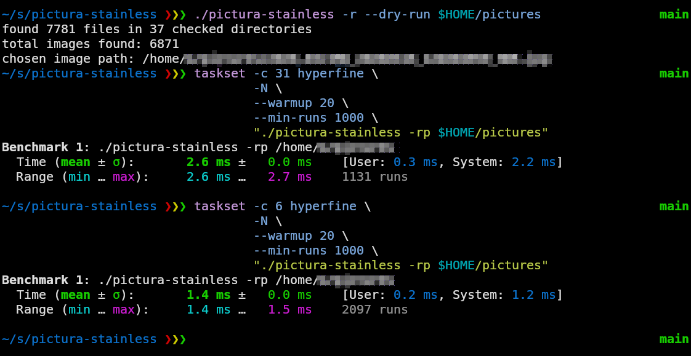

# pictura-stainless

A random wallpaper picker and setter for Linux.

It recursively traverses a directory, selects a random image in a single pass using **Reservoir Sampling**, and sets it as your desktop wallpaper via **Quickshell / Noctalia Shell**.

This is C implementation of the idea by saahriktu, his version in Rust can be found here: https://sourcecraft.dev/saahriktu/pictura-noctis?rev=main

---

## Features



- **Single-Pass Random Selection:** Uses Reservoir Sampling (Algorithm R) to guarantee an exact uniform distribution across arbitrary numbers of images without storing file lists in memory.
- **Cycle Detection:** No infinite loops caused by symlink cycles.
- **Supported Formats:** `.jpg`, `.jpeg`, `.png`, `.webp`, `.jxl`, `.avif`, `.gif`, `.bmp`, `.tif`, `.tiff`, `.heic`.

---

## Window Manager & Compositor Setup

`pictura-stainless` can be easily paired with your window manager using the `-p` flag. 

See the **[Window Manager Integration Guide](WM_INTEGRATION.md)** for copy-paste configurations, keybindings, and auto-rotation timers for:

- **Wayland:** Sway, Hyprland, River, Niri (`swaymsg`, `swww`, `hyprpaper`)
- **X11:** i3wm, bspwm, dwm, AwesomeWM, Qtile (`feh`, `xwallpaper`)
- **Automation:** Systemd user timers & shell background loops

---

## Requirements

- **OS:** Linux
- **Compiler:** GCC 13+ or Clang 16+ (requires C23 support)
- **Optional Runtime:** [Quickshell](https://quickshell.outfoxxed.me/) with Noctalia Shell (`qs`) for wallpaper setting

---

## Building & Installation

### Build release binary:
```sh
git clone https://github.com/x6prl/pictura-stainless.git
cd pictura-stainless
make
```

#### GCC <16, Clang <18

```
make CSTD=gnu2x
```

### Install:
```sh
# System-wide (/usr/local/bin)
sudo make install

# Or to user directory (~/.local/bin)
make install PREFIX=$HOME/.local
```

---

## Usage

```sh
pictura-stainless [OPTIONS] <directory>
```

### Options

| Flag | Description |
| :--- | :--- |
| `-r`, `--recursive` | Recursively search subdirectories (default is non-recursive). |
| `--dry-run` | Picks an image and prints info, but does not run `qs` to set wallpaper. |
| `-q`, `--quiet` | Suppresses standard info output (`total_images`, etc.). |
| `-p` | Prints **only** the chosen image path (no trailing newline) and exits without setting wallpaper. Ideal for shell scripting. |
| `-v`, `--version` | Displays version information and exits. |
| `-h`, `--help` | Displays help message and exits. |

### Environment Variables

| Variable | Description |
| :--- | :--- |
| `PICTURA_STAINLESS_TIMEOUT_MS` | Timeout in milliseconds for the `qs` IPC wallpaper call (default: `5000`). |

---

## Examples

#### 1. Set a random wallpaper from a folder (top-level only):
```sh
pictura-stainless ~/Pictures/Wallpapers
```

#### 2. Set a random wallpaper searching all subfolders recursively:
```sh
pictura-stainless -r ~/Pictures/Wallpapers
```

#### 3. Dry run (preview selection and count without setting wallpaper):
```sh
pictura-stainless -r --dry-run ~/Pictures/Wallpapers
```

#### 4. Quiet mode (set wallpaper silently, bundled flags):
```sh
pictura-stainless -rq ~/Pictures/Wallpapers
```

#### 5. Custom Quickshell IPC timeout (e.g., 10 seconds):
```sh
PICTURA_STAINLESS_TIMEOUT_MS=10000 pictura-stainless -r ~/Pictures/Wallpapers
```

#### 6. Pipe chosen path into other tools (e.g., `swww`, `sway`, `feh`):
```sh
swww img "$(pictura-stainless -rp ~/Pictures/Wallpapers)"
swaymsg output "*" bg "$(pictura-stainless -rp ~/Pictures/Wallpapers)" fill
feh --bg-fill "$(pictura-stainless -rp ~/Pictures/Wallpapers)"
```

---

## Exit Codes

| Code | Meaning |
| :---: | :--- |
| `0` | Success |
| `1` | Path not found, not a directory, no images found, or `qs` command failed / timed out |
| `2` | `qs` binary not found in `$PATH` or failed to spawn |

